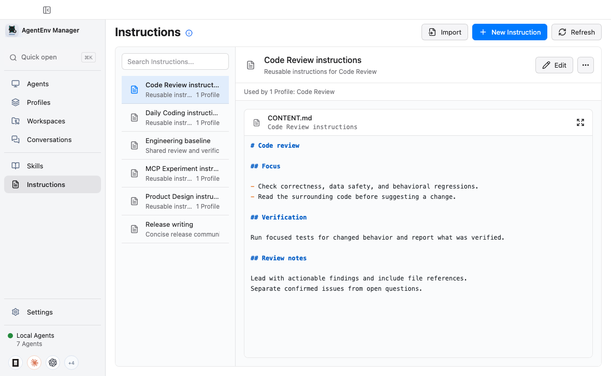

# AgentEnv Manager

English | [简体中文](README.md)

[](https://github.com/chroming/agentenv-manager/releases/latest)
[](https://github.com/chroming/agentenv-manager/actions/workflows/ci.yml)
[](LICENSE)

AgentEnv Manager keeps coding agent environments in one place. Its main features are:

- **Profile switching:** Combine Instructions, Skills, Skill Groups, and MCP choices, then apply them to Agents on this computer or an SSH Linux device.
- **Instructions management:** Save reusable instruction blocks and compose them in order into each Agent's instruction file.
- **Skills management:** Import Skills from local folders, ZIP archives, GitHub, or Git repositories, add tags and groups, and keep checking their sources for updates.
- **Project environments:** Save local or SSH Linux project folders, manage their Instructions and Skills, and open an Agent or copy its launch command.
- **Conversation history:** Search local conversations from multiple Agents, return to the original session, or continue with another Agent.
- **Try before Apply:** Preview Profile changes and run the same task with the current setup and a proposed Profile before deciding whether to apply it.
- **AI assistance:** Summarize Skill updates, suggest tags, or analyze Profiles and comparison results. Your configured AI service is called only when you ask.

It does not take over models, accounts, credentials, or entire configuration files. It only manages the Instructions, Skills, and MCP switches explicitly supported by each Agent integration.


Screenshots use demo data. Comparison results are generated by a test CLI.

## Install

The recommended macOS installation is the official Homebrew Cask:

```bash
brew install --cask chroming/tap/agentenv-manager
```

Upgrade an existing installation with:

```bash
brew upgrade --cask chroming/tap/agentenv-manager
```

Homebrew downloads the official Release for your architecture, verifies its SHA-256, and removes quarantine. Installers for macOS, Windows, and Linux are also available from [GitHub Releases](https://github.com/chroming/agentenv-manager/releases/latest).

Formal macOS packages use the project's fixed self-signed identity, without a Developer ID or notarization. The fixed identity lets macOS recognize upgrades as the same application. Browser downloads still require you to copy the app to Applications, eject the DMG, and follow [Apple's instructions](https://support.apple.com/guide/mac-help/open-a-mac-app-from-an-unknown-developer-mh40616/mac) to choose Open Anyway. After an install or upgrade, macOS may request the login password to authorize the current app to access AgentEnv Manager's secure storage in the system Keychain. This is a macOS system prompt; the password is not provided to AgentEnv Manager. After first install, both Homebrew and direct downloads can check, verify, and install updates from Settings when the application folder is writable. A failed direct-update launch restores the previous version automatically.

## First run

1. Launch the app and confirm the Agents it detected. Agents that are not installed stay disabled by default. To manage a remote environment, add a Linux device from your SSH configuration.
2. Configure an Agent from the Agents page. Save its current setup and reusable Skills to a Profile and the Library, or start with an empty Profile.
3. Changes are saved to the Profile automatically. Review the Apply preview before writing to the Agent. AgentEnv creates a recovery point first and attempts an automatic rollback after a failed write.
4. Local Skills Manager appears only when Capture or Apply finds relevant local Skills that need confirmation. You can also open it from Skills when you want to organize the whole device.

## Profiles

A Profile contains a reusable Agent setup. It can compose ordered Instructions, select individual Skills, or include a Skill Group that continues to follow Library membership changes. MCP settings contain only enablement choices for servers already known to a supported Agent. Each resource type can use the Profile, be turned off, or keep the Agent's current state. Changes are saved to AgentEnv automatically but are not written to an Agent until Apply.


Before Apply, AgentEnv reads the target again and lists resources that will be added, replaced, removed, preserved, or need confirmation. It writes only after confirmation and verifies the result.

To discard changes that have not been Applied, restore the Profile version from the last successful Apply to that Agent. Recovery in the Profile menu also keeps recent edit history.

### Compare before Apply

Compare runs the same task once with the current Agent setup and once with the proposed Profile. Results show both responses, file changes, duration, and token usage reported by the CLI.


Both runs use isolated temporary Homes and Workspaces. Compare does not Apply the Profile or modify the real Agent or original folder, but it consumes quota from the Agent account. It currently requires macOS. OpenCode, Claude Code, Codex, Antigravity CLI, and Pi have verified implementations; Trae CLI does not expose a reliable one-shot command.

## Instructions

The Instruction Library stores reusable Markdown instruction blocks. A Profile can reference several Instructions, order them, and compile them into the instruction file used by the selected Agent during Apply. The Library and Profile use the same preview and editor, and editing shows which Profiles will be affected.



Project instructions in a Workspace remain owned by that folder and are not automatically linked to the Instruction Library.

## Workspaces

Workspaces keep local or SSH Linux folders and show the resources available to the selected Agent. Edit supported Instructions or copy a Library Skill or a Skill Group's enabled members into project-owned files. Browse remote folders when adding an SSH workspace instead of typing paths. Quick Open finds both local and remote workspaces.


The folder remains the source of truth. A Workspace is not bound to a Profile, does not contain Library links, and does not stage or commit Git changes. A Skill Group is a one-time selection recipe here; its identity is not written into the project after copying. Removing a Workspace deletes only the app reference. Explicit Workspace resource changes keep recovery records, so you can undo the latest change or restore an earlier version from Recovery.

Open local folders with an installed Agent. For remote folders, supported integrations offer a remote editor entry point or a copyable SSH launch command.

## Skill Library

The Library keeps one reusable copy of each Skill. Import from a local folder, ZIP archive, GitHub path, or regular Git repository, then install Skills into Agent-specific directories through Profiles. Tags help filter Skills by task. Manual Skill Groups can add a reusable set to several Profiles and keep those Profiles aligned when group membership changes.


The source view shows additions, updates, and removals within a repository or folder. It also supports merging sources, ignoring entries, and disabling update checks. `Groups` maintains manual collections; turning off a group preserves each member's own switch state. `Local Skills` handles existing duplicate copies, content conflicts, broken links, and shared collections. Every cleanup action has a preview and keeps recovery records for changed files.

Before updating or adding a source Skill, inspect its files or request an AI summary of behavior changes, compatibility, and potential risks. Summaries are saved for that content version; reopening one does not call the AI service again. Tags distinguish fixed labels you maintain from AI suggestions, which you can refresh or make fixed.

## Conversations

Conversations indexes local Agent history. Search titles and messages, filter by folder, sort by latest conversation time or file size, return to the original session, or hand it off to another Agent.


Browsing and searching are read-only. For supported Agents, you can explicitly move a conversation to another working directory after previewing the impact. The source Agent still owns the history; conversations are not included in Profiles or Device Sync.

## Supported Agents

- OpenCode
- Claude Code
- Codex (standalone CLI or Codex bundled in the newer ChatGPT desktop app)
- Antigravity CLI
- Antigravity desktop app
- Trae CLI
- Pi Coding Agent

Instructions, MCP, Conversations, and Compare support differs between Agents. The app shows only actions supported by the current Agent.

The Agents page can also read the current user's SSH configuration and add Linux devices. Remote Profile Apply uses system SSH and manages only adapter-supported remote Instructions and copied Skills. Remote MCP definitions and credentials remain owned by the Agent.

## More features

- Device Sync uses a dedicated private Git repository for portable Profiles, the Instruction Library, the Skill Library, and manual Skill Groups. Pull and publish both require review, and sync never Applies changes to a local Agent.
- Recovery collects recovery points created by Apply, Profile edits, Workspace changes, Skill cleanup, and sync. You can inspect files before restoring them.
- GitHub sign-in raises API limits for repository imports and update checks. Regular Git and SSH repositories use system Git credentials.
- The interface supports English, Simplified Chinese, and Traditional Chinese.

## Safety and privacy

- Profile writes follow Preview, Backup, Apply, and Verify. A semantic no-op does not write files.
- AgentEnv changes only files or fields declared by each Agent integration. Agents continue to own MCP definitions and credentials.
- Repository scans use a separate cache and never modify an existing checkout. Device Sync excludes credentials, Agent state, Backups, and local absolute paths.
- AI assistance requires a service endpoint, model, and API key in Settings. Manual analysis sends relevant content, which may include private files, and uses your provider's quota. Disable all AI features or individual ones in Settings. Results are suggestions, not a security certification, and do not modify resources for you.
- Official builds send at most one anonymous installation event per day by default. It contains a random installation ID, app version, operating-system family and major version, architecture, interface language, and install channel. You can preview every field or disable reporting in Settings.

See [Product contracts](docs/product-contracts.md) for exact behavior and [PRIVACY.md](PRIVACY.md) for local data and network access.

## Run from source

You need Node.js 22.12 or newer, npm 10 or newer, and Git.

```bash
npm ci
npm run dev
```

Common commands:

```bash
npm run test:quick       # Tests selected from the current diff
npm run verify:commit    # Full pre-commit verification
npm run verify:release   # Packaged app and release gates
npm run dist:mac         # macOS installers
npm run dist:win         # Windows installer
npm run dist:linux       # Linux installers
```

Use isolated application data and an isolated Agent Home when developing filesystem operations. See [Development](docs/development.md) for setup, architecture, testing, and releases.

## Contributing

Read [CONTRIBUTING.md](CONTRIBUTING.md) before sending changes. Report security issues privately through [SECURITY.md](SECURITY.md).

AgentEnv Manager is licensed under the [GNU General Public License v3.0](LICENSE). Product names and logos belong to their owners; see [THIRD_PARTY_NOTICES.md](THIRD_PARTY_NOTICES.md). This independent project is not affiliated with or endorsed by the Agent vendors listed above.
