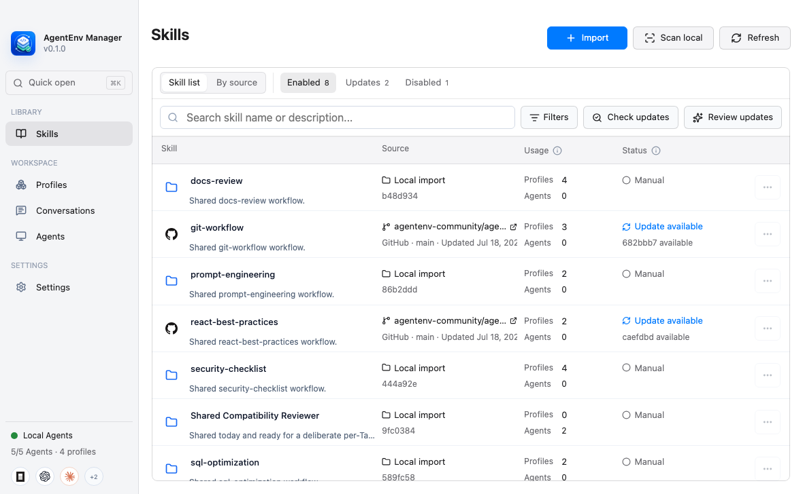

# AgentEnv Manager

[English](README.en.md) | [简体中文](README.md)

AgentEnv Manager is a local-first macOS desktop application for organizing,
previewing, and switching reusable environments across local coding agents.

An environment can include instruction files, Skills from a shared Library,
and sparse enablement choices for MCP servers that already exist in an Agent.
Agent-native definitions, credentials, and unrelated settings remain owned by
the Agent.



## Status

AgentEnv Manager is pre-release software at version `0.1.0`. The current build
has real integration coverage for OpenCode, Claude Code, Codex, Antigravity,
Trae CLI, and Pi Coding Agent. Review every Preview carefully and keep an independent backup
before first taking over an important Agent environment.

| Platform | Status |
| --- | --- |
| macOS arm64 | Development, packaging, and packaged E2E verified |
| macOS x64 | Source build expected; continuous release verification pending |
| Windows / Linux | Not supported |
| Signed public DMG | Not published yet |

## Highlights

- Create, edit, duplicate, capture, preview, and apply reusable Profiles.
- Keep Skills in one Library instead of duplicating full files across Agents.
- Import one Skill, a repository directory, or a repository through GitHub,
  generic HTTPS Git, or SSH Git.
- Detect local Skill copies, duplicates, conflicts, broken links, and unmanaged
  locations before cleanup.
- Preview filesystem changes before Apply, then back up, stage, verify, and
  recover mutations.
- Discover existing MCP definitions and manage only supported enablement fields.
- Search local conversation history and continue visible context in another
  Agent without mutating the source history.
- Sync portable Profiles and Library resources through a user-owned private Git
  repository without syncing credentials, machine state, or backups.
- Use the interface in English, Simplified Chinese, or Traditional Chinese.

## Run from Source

Requirements:

- macOS;
- Node.js 22.12 or newer;
- npm 10 or newer;
- Git.

```bash
npm ci
npm run dev
```

For filesystem development, isolate both application data and the Agent home:

```bash
export AGENTENV_DATA_ROOT="$PWD/.agentenv-runtime/data"
export AGENTENV_HOME="$PWD/.agentenv-runtime/home"
npm run dev
```

## Verify and Package

```bash
npm run build
npm test
npm run test:e2e
npm run verify:release
```

Create an unsigned local application:

```bash
npm run pack
```

Create a signed and notarized release after configuring Apple credentials:

```bash
npm run dist:mac:signed
```

See [docs/development.md](docs/development.md) for architecture, safe test
homes, Target integrations, and release verification.

## GitHub OAuth for Forks

The official build uses the maintainer's public OAuth Client ID for GitHub
Device Flow. Fork maintainers should register their own GitHub OAuth App,
enable Device Flow, and build with:

```bash
AGENTENV_GITHUB_OAUTH_CLIENT_ID=your_client_id npm run dist:mac
```

This is a source/build override, not a setting end users need to manage.
OAuth tokens are encrypted with macOS secure storage.

## Data and Security

Application data is stored under `~/.config/agentenv-manager` by default.
AgentEnv Manager does not include telemetry, advertising, or an
application-operated cloud service.

Read [PRIVACY.md](PRIVACY.md) for local data, network, and removal behavior.
Report vulnerabilities according to [SECURITY.md](SECURITY.md).

## Contributing

Read [CONTRIBUTING.md](CONTRIBUTING.md) before opening a pull request. Product
semantics and filesystem ownership rules are documented in
[docs/product-contracts.md](docs/product-contracts.md).

AgentEnv Manager is licensed under the [Apache License 2.0](LICENSE). Product
names and logos belong to their respective owners; see
[THIRD_PARTY_NOTICES.md](THIRD_PARTY_NOTICES.md). This independent project is
not affiliated with or endorsed by OpenAI, Anthropic, OpenCode, Google,
ByteDance, or Earendil Works.
