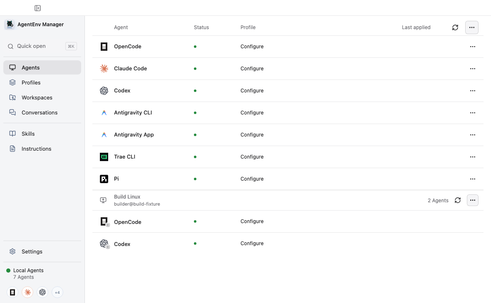
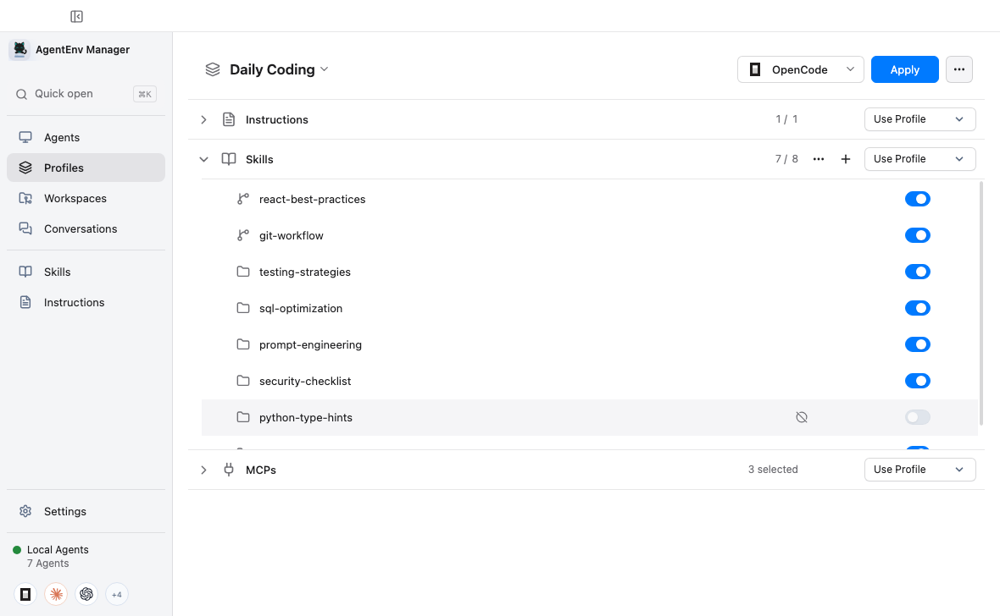
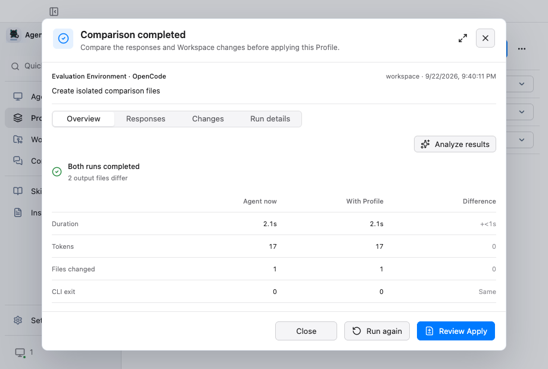
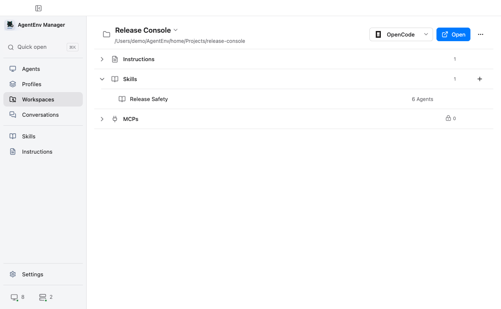
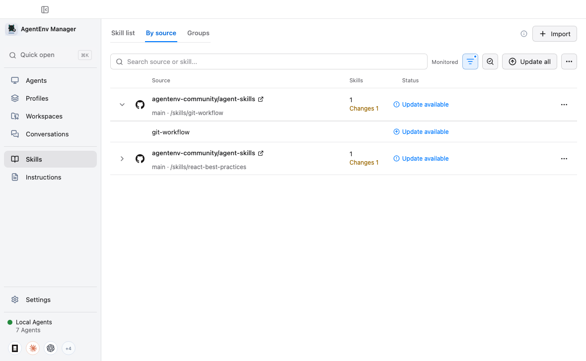
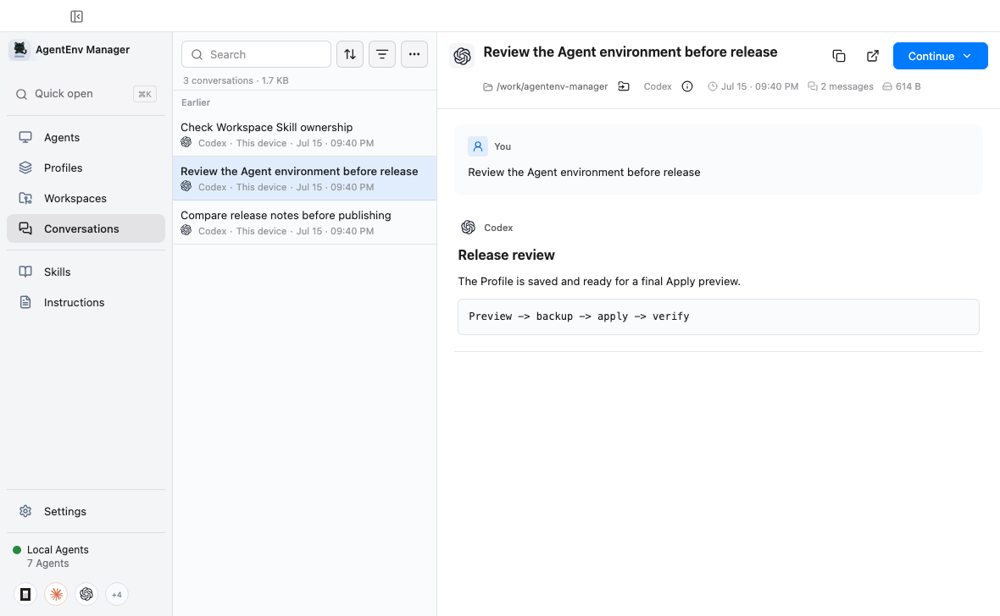

# AgentEnv Manager

[English](README.en.md) | 简体中文

[](https://github.com/chroming/agentenv-manager/releases/latest)
[](https://github.com/chroming/agentenv-manager/actions/workflows/ci.yml)
[](LICENSE)

AgentEnv Manager 是一个本地桌面应用，用来管理多个 coding agent 的 Profiles、Skills 和历史对话。你可以把一套工作方式保存为 Profile，在写入 Agent 前预览变化、隔离对比运行效果，并在需要时从恢复点还原。

应用只管理每个 Agent 明确支持的 Instructions、Skills 和 MCP 启停状态，不接管模型、账号、凭据或整份原生配置。



## 安装

macOS 推荐使用官方 Homebrew Cask：

```bash
brew install --cask chroming/tap/agentenv-manager
```

更新已安装版本：

```bash
brew upgrade --cask chroming/tap/agentenv-manager
```

Homebrew 会按架构下载官方 Release、验证 SHA-256 并移除 quarantine。macOS、Windows 和 Linux 安装包也可以从 [GitHub Releases](https://github.com/chroming/agentenv-manager/releases/latest) 下载。

macOS 直接下载包使用 ad-hoc 签名，没有 Developer ID 和公证。请先把应用复制到“应用程序”并推出 DMG，再按 [Apple 的说明](https://support.apple.com/guide/mac-help/open-a-mac-app-from-an-unknown-developer-mh40616/mac)选择“仍要打开”。首次安装后，只要应用所在目录可写，Homebrew 和直接下载版本都可以在设置中检查、验证并安装更新；直接更新启动失败时会自动恢复旧版本。

## 第一次使用

1. 启动应用，确认自动检测到的 Agent。没有安装的 Agent 默认保持关闭。
2. 在 Agents 中配置一个 Agent，把当前设置保存为 Profile，或从空 Profile 开始。
3. 如果机器上已经有较多 Skills，先在 `Skills > Local Skills` 中处理重复副本、冲突、共享目录和失效链接。
4. 保存 Profile，查看 Apply 预览，确认变化后再写入 Agent。AgentEnv 会先创建恢复点，并在写入失败时尝试自动回滚。

## Profiles

Profile 保存一套可复用的 Agent 工作方式，包括 Instructions、Library Skills，以及受支持 Agent 中已有 MCP 的启停选择。每类资源都可以使用 Profile 内容、关闭，或保留 Agent 当前状态。



Apply 前，AgentEnv 会重新读取目标环境，列出将新增、替换、删除、保留或需要确认的资源。只有确认后才会写入，并在完成后验证结果。

### Apply 前对比

Compare 会让当前 Agent 设置和候选 Profile 对同一个任务各运行一次，并排展示回复、文件变化、耗时和 CLI 明确上报的 token。



两次运行都使用隔离的临时 Home 和 Workspace，不会 Apply，也不会修改真实 Agent 或原项目。Compare 会消耗对应 Agent 的账号额度，目前仅支持 macOS。OpenCode、Claude Code、Codex、Antigravity CLI 和 Pi 已提供验证过的实现，Trae CLI 暂不支持可靠的一次性运行。

## Workspaces

Workspaces 保存常用本地目录的引用，并展示所选 Agent 会在该目录加载的 Instructions、Skills 和 MCP 名称。你可以编辑受支持的 Workspace Instructions、把 Library Skill 复制为目录中的普通文件，或直接用已安装的 Agent 打开目录。



目录中的文件始终是唯一事实源。Workspace 不绑定 Profile，不创建 Library 链接，也不会替你 stage 或 commit Git 变化。移除 Workspace 只会删除应用内引用。

## Skill Library

Library 为每个 Skill 保存一份可复用内容。可以从本地目录、ZIP、GitHub 路径或普通 Git 仓库导入，再通过 Profile 安装到各 Agent 的专属目录。



按来源视图会显示同一仓库或目录中的新增、更新和删除，也支持合并来源、忽略条目和关闭更新检查。`Local Skills` 用来处理机器上已有的重复副本、内容冲突、失效链接和共享集合。所有清理动作都会先预览，并为改动保留恢复记录。

## Conversations

Conversations 只读索引本机 Agent 的历史记录。可以搜索标题和消息、按目录筛选、回到原对话，或检查上下文后交给另一个 Agent 继续。



原始会话仍归对应 Agent 所有。AgentEnv 不会修改会话数据库，也不会把对话加入 Profile、Backup 或 Workspace Sync。

## 支持的 Agents

- OpenCode
- Claude Code
- Codex
- Antigravity CLI
- Trae CLI
- Pi Coding Agent

不同 Agent 支持的 Instructions、MCP、Conversations 和 Compare 能力并不完全相同。应用只显示当前 Agent 实际支持的操作。

## 其他功能

- Workspace Sync 通过专用私有 Git 仓库同步可移植的 Profiles 和 Skill Library。拉取和发布都需要手动审核，不会自动 Apply。
- Recovery 集中展示 Apply、Skill 清理和同步产生的恢复记录，可以预览文件后再恢复。
- GitHub 登录为仓库导入和更新检查提供更高的 API 限额；普通 Git 和 SSH 仓库使用系统 Git 凭据。
- 界面支持 English、简体中文和繁體中文。

## 安全和隐私

- Profile 写入遵循 Preview、Backup、Apply、Verify 流程；没有语义变化时不会写文件。
- AgentEnv 只修改对应 Agent integration 明确声明可管理的文件或字段。MCP 定义和凭据仍由 Agent 保存。
- Repository 扫描使用独立缓存，不会修改已有 checkout。Workspace Sync 不同步凭据、Agent 状态、Backup 或本机绝对路径。
- 官方构建默认每天最多发送一次匿名安装信息，包括随机安装 ID、应用版本、操作系统类型及主版本、架构、界面语言和安装渠道。可以在 Settings 中关闭并预览完整字段。

完整行为见 [产品契约](docs/product-contracts.md)，数据与网络访问说明见 [PRIVACY.md](PRIVACY.md)。

## 从源码运行

需要 Node.js 22.12 或更高版本、npm 10 或更高版本，以及 Git。

```bash
npm ci
npm run dev
```

常用命令：

```bash
npm run test:quick       # 按当前改动运行相关测试
npm run verify:commit    # 提交前完整验证
npm run verify:release   # 打包应用与发布门禁
npm run dist:mac         # macOS 安装包
npm run dist:win         # Windows 安装包
npm run dist:linux       # Linux 安装包
```

开发文件操作时，请使用隔离的应用数据和 Agent Home。具体设置、架构、测试策略和发布流程见 [开发文档](docs/development.md)。

## 参与项目

提交改动前请阅读 [CONTRIBUTING.md](CONTRIBUTING.md)。安全问题请按 [SECURITY.md](SECURITY.md) 私下报告。

AgentEnv Manager 使用 [GNU General Public License v3.0](LICENSE)。产品名称和标志归各自权利人所有，详见 [THIRD_PARTY_NOTICES.md](THIRD_PARTY_NOTICES.md)。本项目是独立项目，与上述 Agent 的开发者没有隶属或背书关系。
